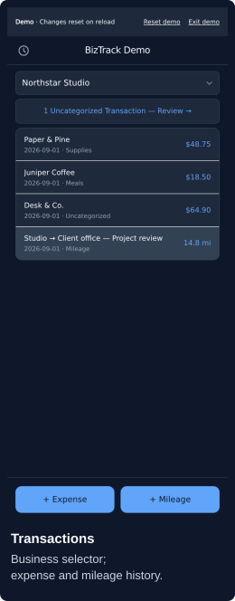
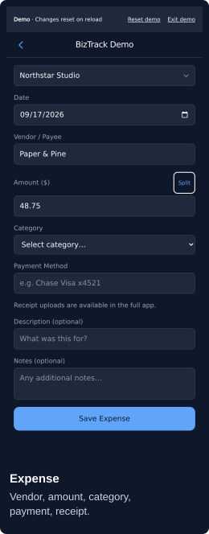
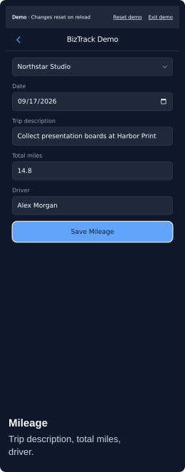

# BizTrack

- Expenses, receipts, mileage; multiple businesses.
- Static web app; records on your device and in your Google Drive.
- Direct Google sync; no BizTrack backend or database.
- No infrastructure setup. Installation optional.

**[Try demo](https://biztrack.lol/demo/)** · **[Open BizTrack](https://biztrack.lol/)**

Screenshots · fictional data

<p>
  <a href="docs/screenshots/transactions.png"></a>
  <a href="docs/screenshots/expense.png"></a>
  <a href="docs/screenshots/mileage.png"></a>
</p>

## For users

1. Choose **Fixed release** (manual upgrades) or **Beta** (automatic updates).
2. **Sign in with Google**; grant Drive access.
3. **Add Business → Select Drive Folder…**; choose a writable folder; name the business. Existing BizTrack folder: **Import Business**.
4. **+ Expense** or **+ Mileage**.

- **Demo:** fictional data; no sign-in; reset on reload.
- **Install:** browser install option; iPhone/iPad: **Share → Add to Home Screen**.
- **Offline:** saved pending changes stay on this device until synced. Sign-in, receipt uploads, and new year folders need connectivity.
- **Switch versions:** sync first; sign in and install separately.
- **Data upgrades (0.2+):** prompted conversion; originals retained in Drive. Use 0.2+ afterward; older versions write to the original files.
- **Permissions:** full Google Drive access. [Data storage and privacy](https://biztrack.lol/beta/privacy/) · [Terms](https://biztrack.lol/beta/terms/).

## For developers

Requirements: Node.js 22+; Python 3 for site previews and release checks. Optional: `nix develop`.

```sh
npm install
npm run dev:demo
```

- **Demo:** `http://localhost:5173/demo/` (or Vite's printed port); no credentials.
- **Google integration:** [OAuth setup](docs/google_cloud_setup.md) → `cp .env.example .env` → set `VITE_GOOGLE_CLIENT_ID` → `npm run dev`.
- **Homepage preview:** `npm run preview:site` → `http://localhost:8080`; restart after edits. Chooser only; local tags, no app builds.
- **Checks:** `npm test && npm run check`.
- **Build:** `npm run build` → `build/`; `npm run build:demo` → `build-demo/`.

[Architecture and schemas](docs/specification.md) · [Release operations](docs/releases.md) · [Decisions](docs/log.md) · [AGPL-3.0-only](LICENSE)
