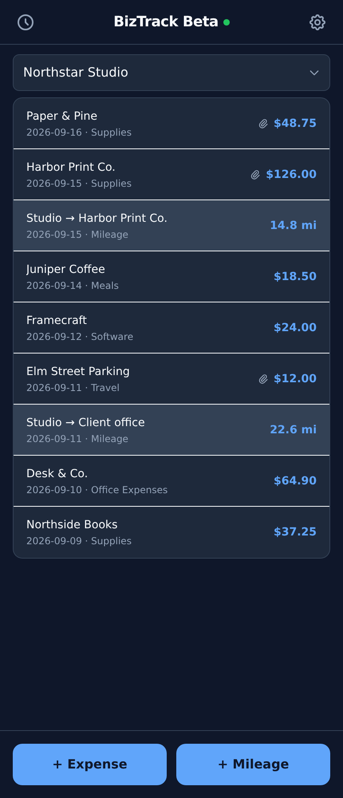
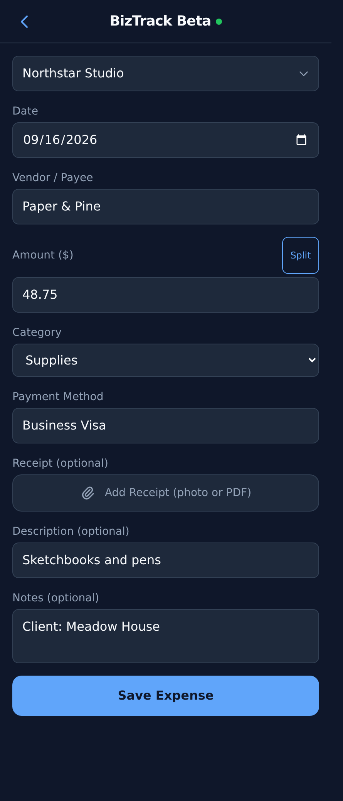
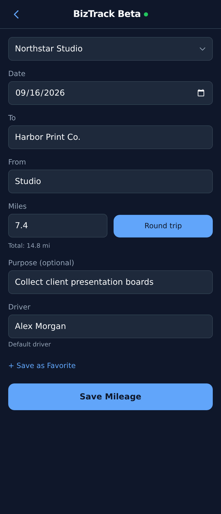

# BizTrack

Static PWA for tracking expenses and mileage across multiple businesses. Runs in your browser; data stays on your device and in your Google Drive. No BizTrack backend or database. **No infrastructure setup required to use it.**

[User instructions](#for-users) · [Developer instructions](#for-developers)

Mobile views with fictional business and transaction data.

<p></p>

**Transactions:** View expenses and mileage for the selected business; tap an entry to edit it.

---

<p></p>

**Expense:** Record the vendor, amount, category, payment method, and an optional receipt.

---

<p></p>

**Mileage:** Record the route, distance, purpose, and driver; double the distance for a round trip.

## For users

### Get started

You need a browser, a Google account, and internet access to sign in and sync. No Google Cloud project, API credentials, or developer tools needed.

1. Open [BizTrack](https://biztrack.lol) and choose a fixed version or **Beta**.
2. Select **Sign in with Google** and grant Drive access.
3. Choose **Add Business → Select Drive Folder…**. Pick a writable folder and name the business, or use **Import Business** if the folder already contains one.
4. Use **+ Expense** or **+ Mileage**. BizTrack creates the spreadsheets and receipt folders.

Installation is optional: use your browser's install option, or **Share → Add to Home Screen** in Safari on iPhone/iPad.

Fixed versions stay on that release. Beta tracks `main` and updates automatically. Install a new version separately when you want to upgrade. Existing installs can continue in beta with their local data; sync pending changes before switching versions.

Release archives are immutable, but the website owner can still change what Pages serves. Using the hosted app requires trusting its maintainers. Source and download links are on the version chooser.

### Where your data lives

- **Google Drive:** ledgers in Google Sheets; receipts, configuration, and preferences in files. Folder sharing controls access.
- **Your device:** sign-in token, email, cached records, preferences, pending changes, and temporarily cached shared receipts.
- **Website:** serves static app files. Business data goes directly between your browser and Google.

Offline support is limited. The app shell is cached, but authentication, folder creation, receipt uploads, and syncing need a connection. Unsynced changes exist only on this device.

### Reconnecting and signing out

Reconnect with the same Google account when prompted. Your open form and receipt survive reconnection, but not a reload or browser termination. App updates let you defer reloading.

- **Sign Out:** clears this version's local account data; keeps Google permission.
- **Disconnect Google Drive:** also revokes permission, affecting other devices using that grant.

Neither deletes Drive files. Sync or explicitly discard pending changes before either action. Clearing browser site data deletes unsynced work.

BizTrack does not encrypt local data. Sign out on shared devices.

### Features

- Expenses: vendor/payment autocomplete, custom categories, compressed photo receipts, PDFs.
- Mileage: round trips, driver defaults/autocomplete, favorite routes.
- History by year, entry editing, uncategorized review, CSV bank import with vendor/category matching.
- Multiple businesses; My Drive, Shared Drives, and Shared with Me folders.
- Installable PWA, dark theme, offline shell caching, Android receipt sharing ([known limitations](docs/specification.md#known-limitations-and-separate-correctness-work)).

## For developers

For local development or hosting your own copy.

### Setup

- Node.js 22+ and Python 3 (or use `nix develop`)
- Google Cloud project with Drive and Sheets APIs enabled
- OAuth 2.0 web client ID — follow the [Google Cloud setup guide](docs/google_cloud_setup.md)

```sh
nix develop # optional, if using Nix
npm install
cp .env.example .env
```

Set `.env`:

```env
VITE_GOOGLE_CLIENT_ID=<your OAuth client ID>
```

The client ID is public in the browser bundle. Never include an OAuth client secret.

```sh
npm run dev
```

### Tech stack

SvelteKit 2, Svelte 5 runes, Tailwind CSS v4. `adapter-static` outputs directory indexes for each route. `@vite-pwa/sveltekit` uses `injectManifest` for the service worker.

Google Identity Services handles auth; browser `fetch()` calls Drive and Sheets directly. The folder browser uses Drive API v3.

### Drive data structure

```
<Business Folder>/
  config.json              # business UUID, name, and shared categories
  2026/
    2026_<name>_expenses    # Google Sheet (Expenses + Mileage tabs)
    2026_<name>_Receipts/   # uploaded receipt images/PDFs

BizTrack/                   # app-level folder in user's Drive root
  profile.json              # business index, personal favorites/default drivers
```

Each year has its own spreadsheet and receipts folder. Column schemas are in the [specification](docs/specification.md).

### Authentication behavior

Saved tokens expire after roughly an hour. Reconnection verifies the same account before resuming pending API calls. The auth layer retries HTTP 401 once; it does not replay writes after network failures.

Google Testing mode expires consent after seven days; see the setup guide for production configuration.

### Build and deploy

```sh
npm test        # regression checks
npm run check   # TypeScript; excludes plain-JS Svelte scripts
npm run build   # static output in build/
```

[GitHub Actions](.github/workflows/deploy.yml) deploys `main` to `/beta/`. A `v1.2.3` tag publishes an immutable release and serves it at `/v/1.2.3/`. Every deployment reuses existing release archives. Set `VITE_GOOGLE_CLIENT_ID` as a repository secret and [configure release protections](docs/releases.md) before tagging.

For a local beta build: `BIZTRACK_BASE_PATH=/beta npm run build`. Without that setting, development uses `/`.

## Docs

- [Specification](docs/specification.md) — behavior, schemas, limitations, release checks
- [Decision log](docs/log.md)
- [Google Cloud setup](docs/google_cloud_setup.md) — developers only
- [Releases](docs/releases.md) — protections, publishing, migration, verification

## License

[AGPL-3.0-only](LICENSE)
